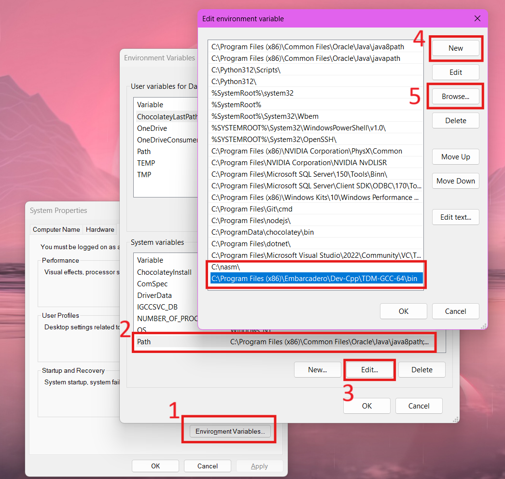

# verticalflip

An assembly-c implementation of flipping an image vertically

To run the files, the following are needed to be set up first:

1. Install NASM
2. Install (Embarcadero) Dev Cpp
3. Add NASM and GCC(MinGW64) to the system variable path

Results of the output are as follows:

Pixel flipping:

Image flipping:
